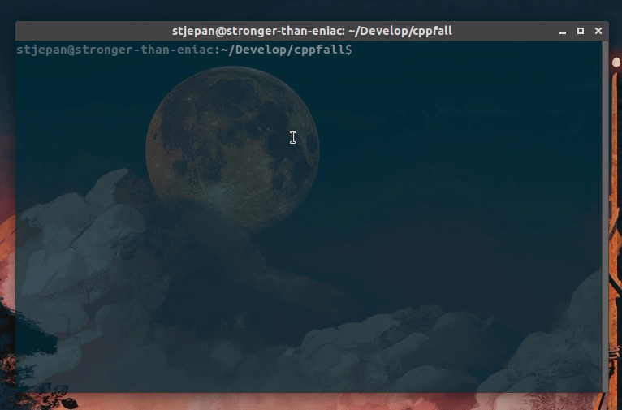

# CppFall

A simple TUI in C++ that emulates particle behaviour (very naively). Similar to cellular automata.

## Build

To build, just run `make`. Then, just run with `./cppfall`.

## Usage

Use arrow keys to move, and the return key to add blocks. Use escape to exit.

## Demo

